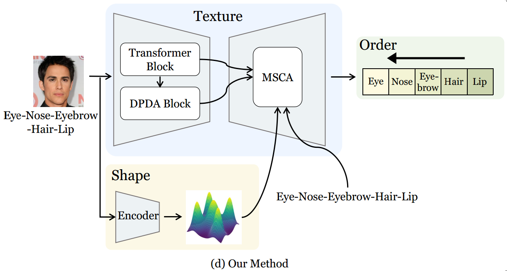

<div align="center">

<h1>Texture, Shape, Order, and Relation Matter: A New Transformer Design for Sequential DeepFake Detection</h1>

<div>
    <a href='https://yunfeili-heng.github.io//' target='_blank'>Yunfei Li</a>,
    <a href='https://yuezunli.github.io//' arget='_blank'>Yuezun Li<sup>*</sup></a>,
    Baoyuan Wu, Junyu Dong, Guopu Zhu, Siwei Lyu
</div>
<div>
    VAS-Group, Ocean University of China&emsp;
</div>

<h4 align="center">
  <a href="https://openaccess.thecvf.com/content/WACV2025/papers/Li_Texture_Shape_and_Order_Matter_A_New_Transformer_Design_for_WACV_2025_paper.pdf" target='_blank'>[Paper]</a>
</h4>


</div>

## 📢 Updates
- [07/2025] The code for the extended paper has been updated.
- [07/2025] <a href="https://arxiv.org/abs/2404.13873"></a>
extension paper released.
- [12/2024] Pretrained models are uploaded.
- [12/2024] Code is released.
- [10/2024] Accepted to WACV 2025.
- [04/2024]  Added <a href="https://arxiv.org/abs/2404.13873"></a>
paper

## 🪧 Introduction
This is the official implementation of *Texture, Shape and Order Matter:
A New Transformer Design for Sequential DeepFake Detection*. In this paper ,we describe
a new Transformer design, called TSOM, by exploring three perspectives: Texture, Shape, and Order of Manipulations. Extensive experimental results demonstrate that our
method outperforms others by a large margin, highlighting the superiority of our method.

The framework of the proposed method:

<div align="center">

</div>


## 🛠️ Installation


### Environment
We recommend using Anaconda to manage the python environment:
```
conda create -n tsom python=3.9
conda activate tsom
conda install -c pytorch pytorch=2.1.1 torchvision=0.16.1 cudatoolkit==11.8
conda install pandas
conda install tqdm
conda install pillow
pip install tensorboard==2.4.1
```


## 📦 Dataset Preparation

### Prepare data
You can download the Seq-Deepfake dataset through this link: <a href="https://lifehkbueduhk-my.sharepoint.com/:f:/g/personal/16483782_life_hkbu_edu_hk/Evp-uhtWYMBLi9G9JlPcKCEBewkMqPCU69L4Kf29qDQaOw?e=G9JaRm" target='_blank'>[Dataset]</a>

After unzip all sub files, the structure of the dataset should be as follows:

```
./
├── facial_attributes
│   ├── annotations
│   |   ├── train.csv
│   |   ├── test.csv
│   |   └── val.csv
│   └── images
│       ├── train
│       │   ├── Bangs-Eyeglasses-Smiling-Young
│       │   |   ├── xxxxxx.jpg
|       |   |   ...
|       |   |   └── xxxxxx.jpg
|       |   ...
│       │   ├── Young-Smiling-Eyeglasses
│       │   |   ├── xxxxxx.jpg
|       |   |   ...
|       |   |   └── xxxxxx.jpg
│       │   └── original
│       │       ├── xxxxxx.jpg
|       |       ...
|       |       └── xxxxxx.jpg
│       ├── test
│       │   % the same structure as in train
│       └── val
│           % the same structure as in train
└── facial_components
    ...
```


## 🚀 Training
Modify `train.sh` and run:
```
sh train.sh
```

Please refer to the following instructions about some arguments:

```
--LOGNAME: Name of your project
--CONFIG: Path of the network and optimization configuration file
--DATA_DIR : Directory to the downloaded dataset.
--DATASET_NAME : Name of the selected manipulation type. Choose from 'facial_components' and 'facial_attributes'.
--RESULTS_DIR : Directory to save logs and checkpoints
```
You can change the network and optimization configurations by adding new configuration files under the directory `./configs/`.


We also provide slurm script that supports multiple GPUs training:
```
sh train_slurm.sh
```
where `PARTITION` and `NODE` should be modified according to your own environment. The number of GPUs to be used can be set through the `NUM_GPU` argument.

## 🏃Testing
Modify `test.sh` and run:
```
sh test.sh
```

For the arguments in `test.sh`, please refer to the training instructions above, plus the following ones:
```
TEST_TYPE : The evaluation metrics to use. Choose from 'fixed' and 'adaptive'.
LOG_NAME  :  Should be set according to the log_name of your trained checkpoint to be tested.
```
We also provide slurm script for testing:

```
sh test_slurm.sh
```

## 🏋️ Pretrained Models
We also provide the pretrained models.

| Model                                                                                                                                                      | Description
|:-----------------------------------------------------------------------------------------------------------------------------------------------------------| :----------
| [pretrained-r34](https://stuouceducn-my.sharepoint.com/:u:/g/personal/liyunfei_x_stu_ouc_edu_cn/EbDYY5UOmbBAjQOy8mOH0EQBaNtDJ8idUdhjvfhbzT55sg?e=fZTLg5) | Trained on `facial_components` and `facial_attributes` with `resnet34` backbone.
| [pretrained-r50](https://stuouceducn-my.sharepoint.com/:u:/g/personal/liyunfei_x_stu_ouc_edu_cn/EWc73GE9cTJKvM2u1Q86I28BvLcrupB3UMQYduXpvO1w_w?e=lI9z6x) | Trained on `facial_components` and `facial_attributes` with `resnet50` backbone.

In order to try the pre-trained checkpoints, please:

1. download from the links in the table, unzip the file and put them under the `./results` folder with the following structure:

    ```
    results
    ├── resnet34
    │    ├── facial_attributes
    │    │   └── test
    │    │       └── snapshots
    │    │           ├── best_model_adaptive.pt
    │    │           └── best_model_fixed.pt
    │    └── facial_components
    │        └── test
    │            └── snapshots
    │                ├── best_model_adaptive.pt
    │                └── best_model_fixed.pt
    └── resnet50
        ...
    ```

2. In `test.sh`, modify `DATA_DIR` to the root of your Seq-DeepFake dataset. Modify `LOGNAME` `CONFIG` and `DATASET_NAME` to `'test'`, `./configs/r34.json` or `./configs/r50.json`, `facial_components` or `facial_attributes` respectively. 
3. Run `test.sh`.


## 🎓 Citation
If you find this work useful for your research, please kindly cite our paper:
```
@inproceedings{li2025texture,
  title={Texture, Shape and Order Matter: A New Transformer Design for Sequential DeepFake Detection},
  author={Li, Yunfei and Li, Yuezun and Wang, Xin and Wu, Baoyuan and Zhou, Jiaran and Dong, Junyu},
  booktitle={2025 IEEE/CVF Winter Conference on Applications of Computer Vision (WACV)},
  pages={202--211},
  year={2025},
  organization={IEEE}
}
```
```
@article{li2025texture,
      title={Texture, Shape, Order, and Relation Matter: A New Transformer Design for Sequential DeepFake Detection}, 
      author={Yunfei Li and Yuezun Li and Baoyuan Wu and Junyu Dong and Guopu Zhu and Siwei Lyu},
      journal={arXiv preprint arXiv:2404.13873},
      year={2025}
}
```

